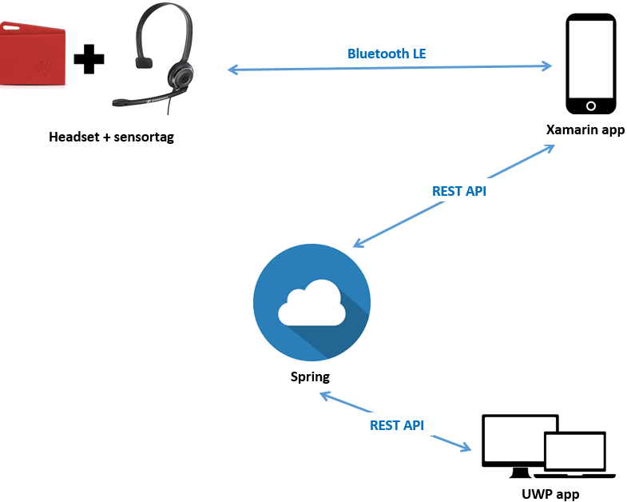

# entmob2016_8
## Groepsleden
- Koen Castermans
- Jasper Szkudlarski
- Stephane Oris
- Brecht Morrhey

## Concept
We gaan de sensor aan een headset hangen en aan de hand van de motion sensors detecteren wanneer de headset wordt opgezet en neergelegd. Met deze informatie zien we twee mogelijke toepassingen. De eerste is eerder voor particulier gebruik en houdt in dat de pc van de gebruiker automatisch vergrendeld wordt en dat alle social media toepassingen op "Away" worden gezet wanneer hij de headset neerlegt. Het omgekeerde gebeurt wanneer hij de headset terug opneemt.

Voor de tweede toepassingen kijken we naar een professionele context zoals een callcenter. Men kan de productiviteit van de werknemers meten door na te gaan wanneer ze hun headset ophebben. We kunnen ook nagaan wanneer ze effectief aan het bellen zijn door geluid te detecteren met de microfoon.We zijn nog niet zeker of dit de microfoon van de Sensortag of van de smartphone zal zijn.
Elke werknemer zal een app op zijn smartphone hebben die verbonden is met de Sensortag. De werknemers krijgen elk unieke inlog gegevens zodat de prestatie van elke werknemer apart gemeten kan worden. 

## Mobiele app
Deze app gaat gebruikt worden om te connecteren met de sensortag zodat de benodigde data verzameld kan worden. Deze app zal ook via de REST API data doorsturen naar de back end.

## UWP app
Deze app zal voor op de computer zijn. Hiermee kan de werkgever de prestaties van alle werknemers bekijken. Dit zal waarschijnlijk op een grafische manier zijn aan de hand van grafieken.

## Architectuur

